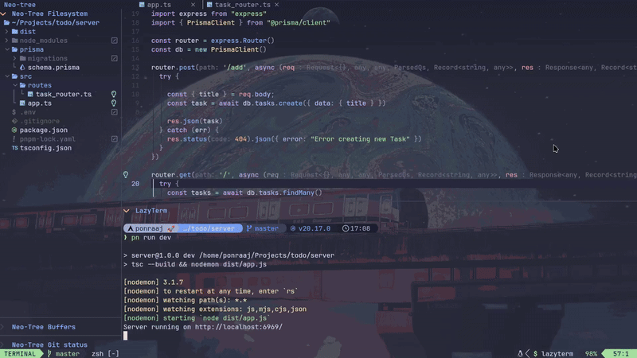

# Todo App

This is just a basic CRUD Application


## Tech Stack

### Front-End

  1. React
  1. Tailwind CSS

### Back-End

  1. Node JS
  1. Express
  1. Prisma ORM
  1. PostgreSQL (Supabase)

----------

### Installation

To run this application locally, follow the steps

```bash
#Clone the repository
git clone https://github.com/Ponraaj/todo.git

#Install packages in client directory
cd ./client/
pnpm i 

#Install packages in server directory
cd ../server/
pnpm i
```

Create a .env file in the server/

```bash
touch .env
```

Fill in these URLs from Supabase

For more info visit [here](https://supabase.com/partners/integrations/prisma)

```env
DATABASE_URL=""
DIRECT_URL=""
```

Run the following command to create a migration

```bash
npx prisma migrate dev --name init
```

**That's it! The setup is complete.**

Now to run the application,

Start the server

```bash
cd ./server/
pnpm run dev
```

Start the client

```bash
cd ./client/
pnpm run dev
```
